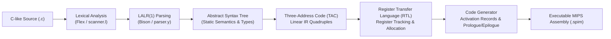

# sclp: An Optimizing C-like Compiler Targeting MIPS/SPIM

[](https://isocpp.org/)
[-green.svg)]()
[]()
[](https://www.cse.iitb.ac.in/)

> **Academic Affiliation**: Course Project for **CS 306: Implementation of Programming Languages**, IIT Bombay  
> **Instructor**: **Prof. Uday Khedkar**  
> **Authors**: **Dheeraj Kumar Maradana** ([@dheerajkumar2005](https://github.com/dheerajkumar2005)) & Group 10

---

## 📌 Executive Summary

This repository contains the complete implementation and technical report for **`sclp` (Simple C-Like Program)**, a multi-stage optimizing compiler built from scratch in C++. 

Targeting the **MIPS R2000/R3000** architecture simulated via SPIM, the compiler translates statically typed imperative source programs featuring integers, single-precision floats, strings, complex control flow structures (`if-else`, `while`, `do-while`), and multi-parameter functions into executable MIPS assembly.

---

## 🏗️ Compiler Architecture & Lowering Pipeline



### Core Pipeline Stages:
1. **Lexical & Syntactic Analysis (`scanner.l`, `parser.y`)**:
   * Recognizes composite operators (`<=`, `>=`, `==`, `!=`, `&&`, `||`), literals, and nested block comments.
   * LALR(1) grammar resolving shift-reduce conflicts for dangling `else` constructs and operator precedence.
2. **Semantic Analysis & Scope Resolution (`Program.cpp`, `Ast.cpp`)**:
   * Hierarchical symbol tables enforcing static scoping (`GLOBAL` vs. `FUNCTION` lexical tiers).
   * Validates function signatures, arities, return types across all branching control paths, and prevents illegal shadowing.
3. **Intermediate Representations (IR)**:
   * **Abstract Syntax Tree (AST)**: Captures hierarchical program structure with type annotations.
   * **Three-Address Code (TAC)**: Flattens expressions into linearized quadruples with temporary variables.
   * **Register Transfer Language (RTL)**: Explicit machine-level operations mapping virtual temporaries to physical hardware registers.
4. **Register Allocation & Activation Record Layout (`RegisterTracker.cpp`, `Code.cpp`)**:
   * Dynamic linear register tracking across general-purpose MIPS registers (`$t0–$t9`, `$s0–$s7`, `$v0`, `$a0–$a3`) and floating-point registers (`$f0–$f31`).
   * Generates standard MIPS calling conventions, stack frame layout, and callee/caller register save/restore sequences.

---

## 📁 Repository Structure

```
├── A5-Resources-x86_64/
│   ├── src/                    # Compiler source files
│   │   ├── Ast.cpp / Ast.hpp   # Abstract syntax tree classes
│   │   ├── TAC.cpp / TAC.hpp   # Three-Address Code generation
│   │   ├── RTL.cpp / RTL.hpp   # Register Transfer Language lowering
│   │   ├── RegisterTracker.cpp # MIPS physical register pool allocation
│   │   ├── parser.y / scanner.l# Bison grammar and Flex lexer
│   │   ├── Program.cpp / .hpp  # Symbol tables and scope resolution
│   │   └── sclp.cpp            # Compiler CLI driver entrypoint
│   └── tests/                  # Test suites for parsing, AST, TAC, RTL, and MIPS
├── CS306_Compiler_Project_Report.tex # Comprehensive technical LaTeX report
├── report.pdf                  # Formatted end-to-end project report
└── script.sh                   # Build and test execution script
```

---

## 🚀 Building & Running

### Prerequisites
* Linux (x86_64)
* GCC / G++ (`g++ -std=c++17 -O2`)
* Flex (`>= 2.6`)
* Bison (`>= 3.5`)
* SPIM MIPS Simulator (`spim`)

### 1. Compile the Compiler
```bash
cd A5-Resources-x86_64/src
make -j$(nproc)
# Produces the executable binary `sclp`
```

### 2. Compile a Program to MIPS Assembly
```bash
# Output AST representation
./sclp --show-ast program.c

# Output Three-Address Code (TAC)
./sclp --show-tac program.c

# Generate final MIPS assembly code
./sclp --assembly program.c
```

### 3. Run on MIPS Simulator
```bash
spim -file program.spim
```
